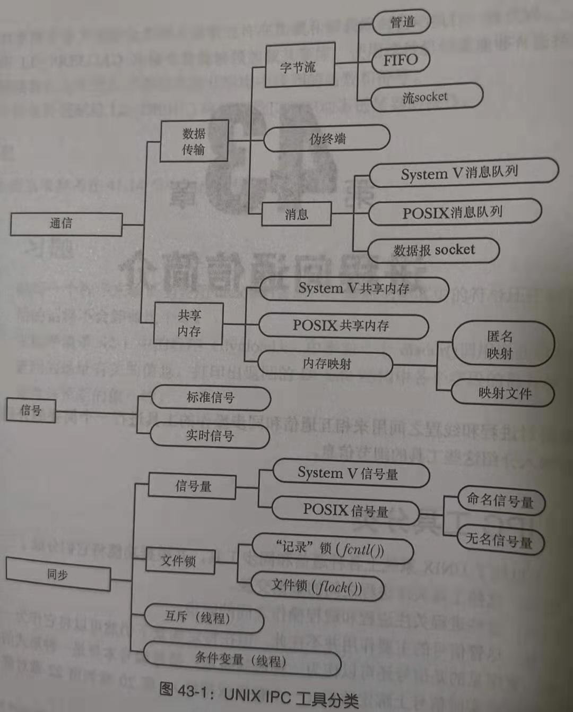
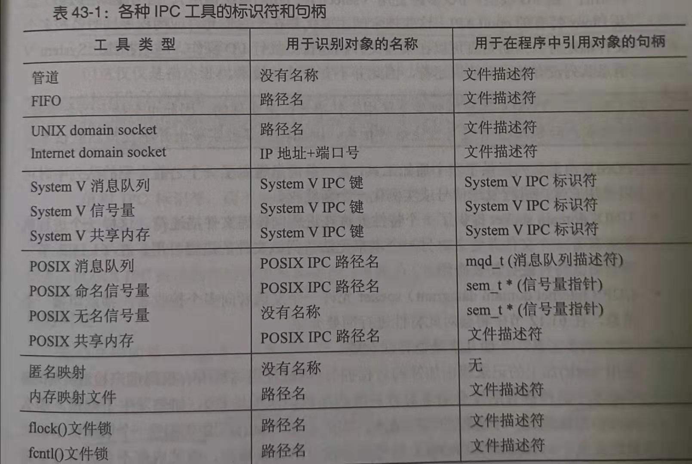
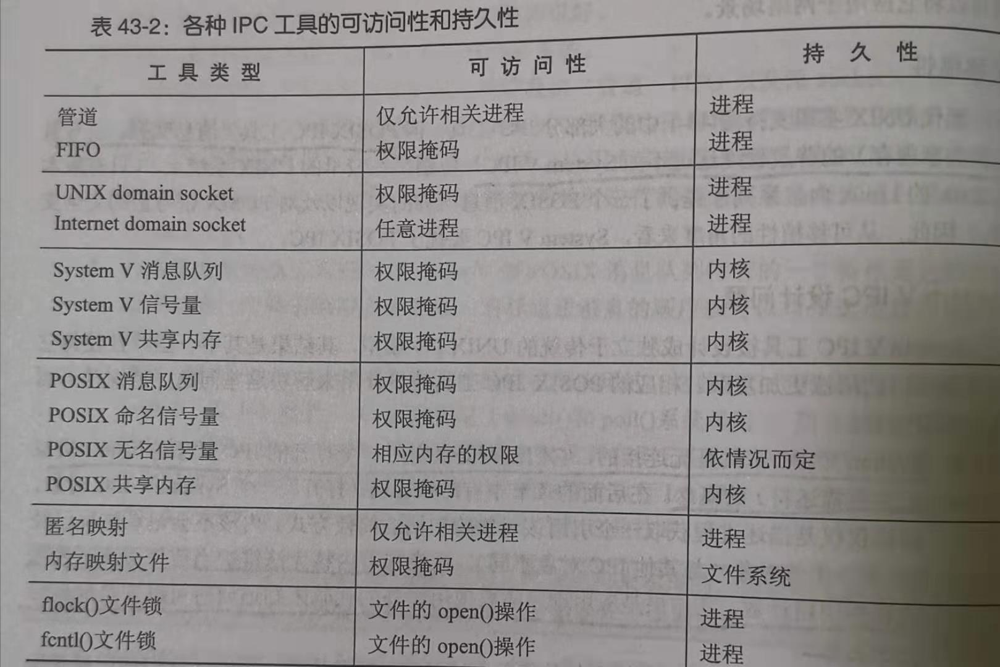

# 第43章 进程间通信简介
### IPC工具分类

- 通信：这些工具关注进程之间的数据交换。
- 同步：这些进程关注进程和线程操作之间的同步。
- 信号：尽管信号的主要作用并不在此，但在特定场景下仍然可以将它作为一种同步技
术。
##### 数据传输
- 字节流：通过管道、FIFO 以及数据报 socket 交换的数据是一个无分隔符的字节流。每个读取操作可能会从 IPC 工具中读取任意数量的字节
- 消息：通过 System V 消息队列、POSIX 消息队列以及数据报 socket 交换的数据是以分隔符分隔的消息。
- 伪终端：伪终端是一种在特殊情况下使用的通信工具
##### 共享内存
下面是使用共享内存时的注意点。
- 尽管共享内存的通信速度更快，但速度上的优势是用来弥补需要对在共享内存上发生的操作进行同步的不足的。如当一个进程正在更新共享内存中的一个数据结构时，另一个进程就不应该试图读取这个数据结构。在共享内存中，信号量通常用来作为同步方法。
- 放入共享内存中的数据对所有共享这块内存的进程可见。
### 同步工具
UNIX 系统提供了下列同步工具。
- 信号量:一个信号量是一个由内核维护的整数，其值永远不会小于 0。一个进程可以增加或减小一个信号量的值。
- 文件锁：文件锁是设计用来协调操作同一文件的多个进程的动作的一种同步方法。
- 互斥体和条件变量：这些同步工具通常用于 POSIX 线程
### 各种IPC工具的标识符和句柄

### 各种IPC工具的可访问性和持久性

### 可访问性
- 管道、FIFO、socket的可访问性时根据相关的文件权限掩码确定，虽然System V IPC对象并不位于文件系统，但每个对象有一个相关的权限掩码，其语义与文件的权限掩码类似
- 一些IPC工具如管道、匿名内存映射被标记为只允许相关进程访问，“相关”是通过fork关联
- 为了给文件加锁，进程必须拥有该文件的文件描述符（即打开此文件的权限）
- POSIX未命名信号量的可访问性通过包含该变信号量的共享内存区域的可访问性确定
- Internet domain socket的访问没有限制
### 持久性
- 进程持久性：只要进程持有IPC对象，该IPC对象的生命周期就不会终止
- 内核持久性：只有显式的删除内核持久的IPC对象或系统关闭时，该对象才会销毁
- 文件系统持久性：会在系统重启的时候保持其中的信息，直到被显式的删除，唯一具备文件系统持久性的IPC对象是基于内存映射文件的共享内存